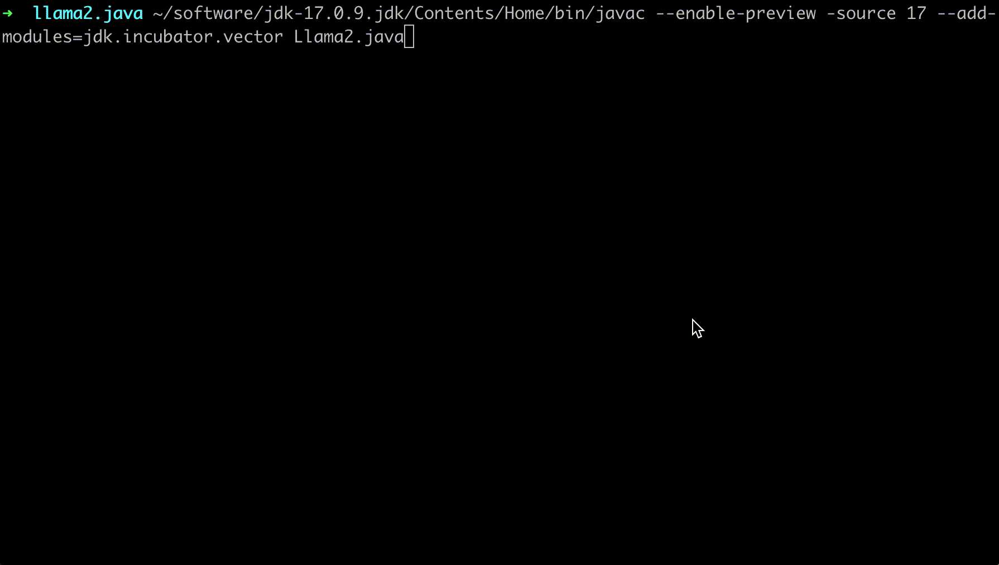

## llama2.java

This is a Java port of Andrej Karpathy's [llama2.c](https://github.com/karpathy/llama2.c), the implementation is able to inference Meta's Llama2 7B model. Llama2.java is designed for educational purpose, and it is in alignment with the original C version to be as simple and minimal as possible.



Specifically regarding performance, Llama2.java offers the same level of token/s compared with C version when doing inference against llama2 7B fp32 model. Please check [Performance](#performance-evaluation) for details.

## feel the magic

First, navigate to the folder where you keep your projects and clone this repository to this folder:

```bash
git clone https://github.com/neoremind/llama2.java.git
```

Then, open the repository folder:

```bash
cd llama2.java
```

Now, let's run a baby Llama 2 model in Java. You need a model checkpoint. Download this 15M parameter model Andrej Karpathy trained on the [TinyStories](https://huggingface.co/datasets/roneneldan/TinyStories) dataset (~60MB download):

```
wget https://huggingface.co/karpathy/tinyllamas/resolve/main/stories15M.bin
```

Note that you can also download models with different size by replacing *stories15M.bin* with *stories42M.bin* or *stories110M.bin*.

Java 17+ is required to compile the source code.

```
javac --enable-preview -source 17 --add-modules=jdk.incubator.vector Llama2.java
```

Run the code.

```
java -Xmx8G --enable-preview --add-modules=jdk.incubator.vector Llama2 stories42M.bin -t 0.8 -n 256 -i "One day, Lily met a Shoggoth"
```

Check more usage as below.

```
Usage:   java --enable-preview --add-modules=jdk.incubator.vector Llama2 <checkpoint> [options]
Example: java --enable-preview --add-modules=jdk.incubator.vector Llama2 model.bin -n 256 -i "Once upon a time"
Options:
  -t <float>  temperature in [0,inf], default 1.0
  -p <float>  p value in top-p (nucleus) sampling in [0,1] default 0.9
  -s <int>    random seed, default time(NULL)
  -n <int>    number of steps to run for, default 256. 0 = max_seq_len
  -i <string> input prompt
  -z <string> optional path to custom tokenizer
  -m <string> mode: generate|chat, default: generate
  -y <string> (optional) system prompt in chat mode
```

## Run Meta's Llama2 model

Get the Llama 2 checkpoints by following the [Meta instructions](https://github.com/facebookresearch/llama).

Please follow Llama2.c provided [steps](https://github.com/karpathy/llama2.c#metas-llama-2-models) to convert the model into the Llama2.c format, so that Llama2.java is able to work with Llama2 7B model.

Run the code.

```
java -Xmx40G --enable-preview --add-modules=jdk.incubator.vector Llama2 llama2_7b.bin -t 0.8 -n 256 -i "New York is a city where"
```

Please note that it takes several seconds to load the weights into memory before inference, also it requires bigger heap memory size for JVM. On my MacBook Intel i7-9750H, this runs super slow. But with my cloud host Intel 16-Core HT Xeon(R) CPU E5-2686 v4 @ 2.30GHz, it can achieve 1.74 tok/s.

## Vectorization and parallelism configurations

You can specify whether vectorization is enabled or not with `-Dvector.matmul.enabled=true|false`. By default, it is enabled to gain the highest performance.

```
java -Dvector.matmul.enabled=true -Xmx40G --enable-preview --add-modules=jdk.incubator.vector Llama2 llama2_7b.bin -n 256 -i "New York is a city where"
```

You can control matrix multiplication (matmul) parallelism with `-Djava.util.concurrent.ForkJoinPool.common.parallelism=X`. By default, it is set according to the number of cores per your machine's CPU specification. You can force using 16 threads to do matmul as shown below.

```
java -Djava.util.concurrent.ForkJoinPool.common.parallelism=16 -Xmx40G --enable-preview --add-modules=jdk.incubator.vector Llama2 llama2_7b.bin -n 256 -i "New York is a city where"
```

## Run int8 quantization model

By default, llama2 7B uses float32 forward pass, where the entire calculation of the forward pass is kept in fp32. You can use the int8 quantized weights to reduce the checkpoint size, and dequantize them at runtime, do float32 inference as normal. Please follow Llama2.c provided [steps](https://github.com/karpathy/llama2.c#int8-quantization) to convert the model into the int8 quantization format, so that Llama2.java can work with smaller sized Llama2 7B model.

Compile and run the code.

```
javac --enable-preview -source 17 --add-modules=jdk.incubator.vector quantization/Llama2_q.java

java -Xmx16G --enable-preview --add-modules=jdk.incubator.vector quantization.Llama2_q llama2_7b_q80.bin -t 0.8 -n 256 -i "New York is a city where"
```

## Performance Evaluation

### Environment

```
CPU: Intel(R) 16-Core HT Xeon(R) CPU E5-2686 v4 @ 2.30GHz
MEM: 128GB

gcc (GCC) 7.3.1 20180712 (Red Hat 7.3.1-17)

java version "17.0.9" 2023-10-17 LTS
Java(TM) SE Runtime Environment (build 17.0.9+11-LTS-201)
Java HotSpot(TM) 64-Bit Server VM (build 17.0.9+11-LTS-201, mixed mode, sharing)
```

### Compiling

**Llama2.c**

For single threaded benchmark, `make run` that equals to `gcc -O3 -o run run.c -lm` and `gcc -O3 -o runq runq.c -lm`.

For multi-threaded benchmarks, `make runomp` that equals to `gcc -Ofast -fopenmp -march=native run.c -lm -o run` and `gcc -Ofast -fopenmp -march=native runq.c -lm -o runq`.

**Llama2.java**

`javac --enable-preview -source 17 --add-modules=jdk.incubator.vector Llama2.java`.

`javac --enable-preview -source 17 --add-modules=jdk.incubator.vector quantization/Llama2_q.java`.

### Run

**Llama2.c**

```
OMP_NUM_THREADS=8 ./run llama2_7b.bin -n 256 -i "New York is a city where"

OMP_NUM_THREADS=8 ./runq llama2_7b_q80.bin -n 256 -i "New York is a city where"
```

**Llama2.java**

```
java -Xmx40G -Dvector.matmul.enabled=false -Djava.util.concurrent.ForkJoinPool.common.parallelism=8 --enable-preview --add-modules=jdk.incubator.vector Llama2 llama2_7b.bin -n 256 -i "New York is a city where"

java -Xmx40G -Dvector.matmul.enabled=false -Djava.util.concurrent.ForkJoinPool.common.parallelism=8 --enable-preview --add-modules=jdk.incubator.vector quantization.Llama2 llama2_7b_q80.bin -n 256 -i "New York is a city where"
```

**Llama2.java w/ vectorization**

```
java -Xmx40G -Djava.util.concurrent.ForkJoinPool.common.parallelism=8 --enable-preview --add-modules=jdk.incubator.vector Llama2 llama2_7b.bin -n 256 -i "New York is a city where"

java -Xmx40G -Djava.util.concurrent.ForkJoinPool.common.parallelism=8 --enable-preview --add-modules=jdk.incubator.vector quantization.Llama2 llama2_7b_q80.bin -n 256 -i "New York is a city where"
```

The test result is based on the highest tok/s achieved in 10 iterations.

### Single-threaded

| Model                          | llama2.c  | llama2.java | llama2.java w/ vectorization |
| :----------------------------- | :-------: | :---------: | :--------------------------: |
| stories15M.bin                 | 55.394990 |  53.052519  |          137.657181          |
| stories42M.bin                 | 19.951490 |  19.300636  |          52.359405           |
| stories110M.bin                | 7.673327  |  7.420664   |          21.046771           |
| llama2 7B                      | 0.126592  |  0.126839   |           0.383107           |
| llama2 7B w/ int8 quantization | 0.363301  |  0.147977   |           0.159049           |

### Multi-threaded

| Model                          |  llama2.c  | llama2.java | llama2.java w/ vectorization |
| :----------------------------- | :--------: | :---------: | :--------------------------: |
| stories15M.bin                 | 651.041667 | 150.088287  |          191.154423          |
| stories42M.bin                 | 196.791444 |  75.332349  |          93.126226           |
| stories110M.bin                | 96.975516  |  37.804878  |          47.538200           |
| llama2 7B                      |  1.837785  |  0.927539   |           1.747796           |
| llama2 7B w/ int8 quantization |  3.110704  |  0.994283   |           1.005275           |

The benchmark results show that for single-threaded situation, llama2.java is very close to C version with little gap, because llama2.c is complied with `-O3` flag, llama2.java with vectorization enabled outperforms C version significantly.

On the other hand, for mutli-threaded comparison, llama2.c is more performant than llama.java in stories series baby model. However, when inferencing llama2 7B model, llama2.java with vectorization enabled is very close to C version, the multi-thread context switch of ForkJoin pool is likely to be the performance killer. Note that the C version is compiled with aggressive `-Ofast -march=native` flags turned out, this boosts llama.c performance .

Lastly, llama2.java int8 quantization implementation performs poorly compared to C version, it is because this requires dynamically quantize and dequantize between float32 and int8 at runtime, which adds overhead, this part is not able to benefit from parallelism and vectorization.

## License

MIT

